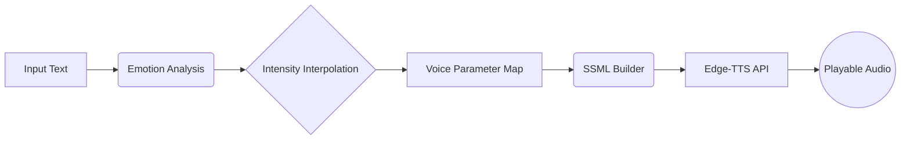

<div align="center">
  <h1>The Empathy Engine 🎙️🧠</h1>
  <p><strong>Text in ➡️ Emotionally modulated, human-like speech out.</strong></p>
  <p>Standard Text-to-Speech is functional but purely robotic. The Empathy Engine bridges the uncanny valley by analyzing granular emotions and automatically injecting dynamic SSML prosody (pitch, rate, pauses) into neural TTS architectures.</p>
</div>


---

## 🌟 The Features

* **7-Class Granular Emotion Model**: Runs `j-hartmann/emotion-english-distilroberta-base` locally to detect joy, anger, fear, disgust, sadness, surprise, and neutral nuances.
* **Continuous Intensity Scalar**: Bypasses hardcoded boundaries. By compounding HuggingFace tensors with VADER semantic scoring and punctuation heuristics, it calculates an intensity multiplier from 0.0 to 1.0. "This is bad" vs "THIS IS ATROCIOUS!!!" scale differently.
* **Smart SSML Prosody Generation**: Automatically generates `<break>` tags, pitch shifting, and rate alteration directly into standard XML SSML without you ever typing a tag.
* **Voice Personas**: Select between 400+ neural voices (Aria, Guy, Sonia, etc.) via a gorgeous Chart.js powered interface.

---

## 🏗️ Architecture



To ensure realistic emotional resonance, vocal parameter changes are mapped scientifically. If **Anger's** base rate modifier is `+25%`, and the VADER intensity scores `0.6` (moderately angry), the system scales the parameter: `25 * 0.6 = +15% rate`. This completely preserves natural human boundaries.

---

## 🚀 Get Started

No API keys needed. Everything runs locally for free.

### 1. Installation
Clone the repository and install the dependencies:
```bash
git clone https://github.com/ShresthChandel/Empathy-Engine.git
cd Empathy-Engine

# Use a virtual environment
python -m venv venv
source venv/bin/activate  # Windows: venv\Scripts\activate

pip install -r requirements.txt
```

### 2. Run the Engine
Start up the Flask server:
```bash
python app.py
```
Visit **`http://127.0.0.1:5000`** to access the UI. The HuggingFace NLP model will download automatically on first run.
