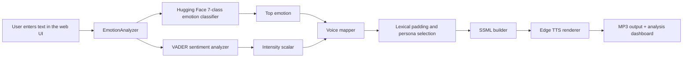
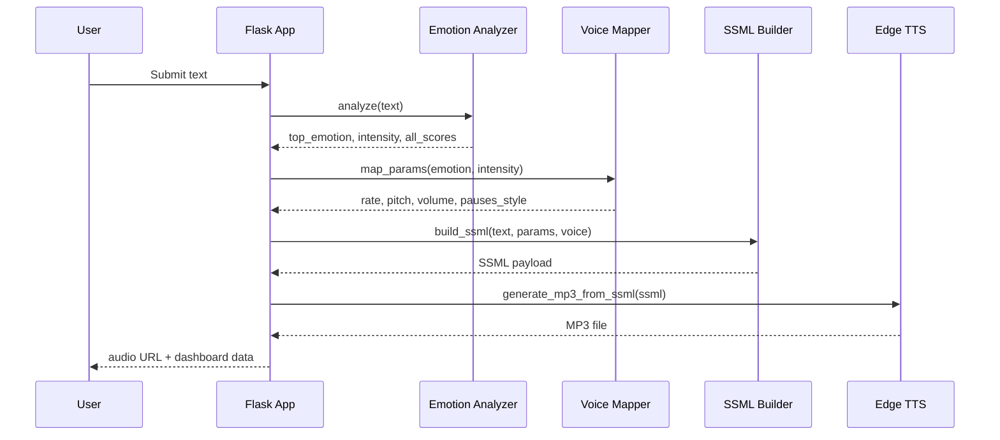

# The Empathy Engine

The Empathy Engine is an emotion-aware text-to-speech web application that converts plain English text into expressive speech. Instead of reading every sentence in the same flat tone, it detects the dominant emotion, measures how strongly that emotion is expressed, and then adjusts neural voice synthesis through SSML prosody controls such as speaking rate, pitch, volume, and pauses.

This project combines a Hugging Face emotion classifier, VADER sentiment scaling, a rule-based voice-parameter mapper, and Microsoft Edge TTS rendering inside a Flask app. The result is a polished interface for experimenting with emotionally adaptive voice output in real time.

## Project Highlights

- 7-class emotion recognition using `j-hartmann/emotion-english-distilroberta-base`
- Intensity scoring that blends classifier output with VADER compound sentiment and punctuation cues
- Dynamic prosody mapping for `rate`, `pitch`, `volume`, and pause style
- Auto-selected voice personas that change with the detected emotion
- Graphical analysis dashboard with confidence bars, intensity display, SSML preview, and custom audio playback
- Local-first workflow with no external API key required for the core app

## Visual Overview

### Landing UI


### Graphical Analysis


### Custom Play/Pause Control and SSML Preview


### Emotion Color Language

The interface intentionally shifts color by dominant emotion so the visual mood matches the generated voice:

- Joy uses a yellow-gold palette
- Sadness uses a blue-cyan palette
- Anger uses red accents
- Fear uses violet highlights
- Surprise uses orange highlights
- Disgust uses lime-green highlights
- Neutral stays in a calm blue baseline


## Why This Project Matters

Traditional TTS pipelines are intelligible, but they often sound emotionally flat. Empathy Engine tries to close that gap by making the synthesis pipeline sensitive to context. A joyful line should sound brighter and faster; a sad line should slow down and soften. This system is designed to produce highly accurate emotion classification for short English inputs and then translate that prediction into audible delivery changes that feel more human.

## End-to-End Architecture



## Emotion-to-Voice Mapping Logic

This is the core design idea of the project: emotion is not mapped to a single fixed voice preset. Instead, the system applies a two-stage transformation:

1. Predict the dominant emotion from the text.
2. Scale vocal changes by intensity so the same emotion can sound mild or extreme.

### Step 1: Emotion Detection

`emotion.py` loads the Hugging Face model `j-hartmann/emotion-english-distilroberta-base`, which returns scores for:

- `joy`
- `sadness`
- `anger`
- `fear`
- `disgust`
- `surprise`
- `neutral`

The highest-confidence label becomes the `top_emotion`.

### Step 2: Intensity Calculation

Intensity is not taken directly from the classifier alone. The app computes it from three signals:

- Absolute VADER compound sentiment score
- Exclamation mark boost
- Uppercase boost for strongly emphasized text

In simplified form:

```text
intensity = min(abs(vader_compound) + exclamation_boost + caps_boost, 1.0)
```

This means:

- `I am happy.` produces a lower intensity
- `I AM SO HAPPY!!!` produces a much higher intensity

### Step 3: Prosody Scaling

Each emotion has a base profile in `voice_mapper.py`, and intensity scales that profile.

```text
final_parameter = base_parameter * intensity
```

Example:

- Base joy rate = `+20%`
- Detected intensity = `0.82`
- Final rate = `int(20 * 0.82)` -> `+16%`

That same pattern is applied to pitch and volume.

### Base Mapping Table

| Emotion | Rate Base | Pitch Base | Volume Base | Pause Style | Intended Effect |
| --- | ---: | ---: | ---: | --- | --- |
| Joy | `+20` | `+15` | `+10` | few | Brighter, faster, more energetic |
| Sadness | `-20` | `-15` | `-20` | long | Slower, softer, reflective |
| Anger | `+25` | `+20` | `+25` | abrupt | Forceful and intense |
| Fear | `+30` | `+20` | `-5` | short | Tense, fast, uncertain |
| Disgust | `-15` | `-10` | `+5` | contemptuous | Detached and clipped |
| Surprise | `+35` | `+30` | `+15` | pause before key | Sudden, elevated, animated |
| Neutral | `0` | `0` | `0` | standard | Stable reference delivery |

### Voice Persona Routing

When the user selects `Auto-Detect (Dynamic Match)`, the app swaps to a matching neural voice:

| Emotion | Auto-selected voice |
| --- | --- |
| Joy | `en-US-EmmaNeural` |
| Surprise | `en-US-EmmaNeural` |
| Anger | `en-US-GuyNeural` |
| Sadness | `en-US-AvaNeural` |
| Fear | `en-US-AvaNeural` |
| Disgust | `en-US-EricNeural` |
| Neutral | `en-US-AriaNeural` |

### Lexical Padding Choices

The project also makes a few deliberate text transformations before synthesis:

- Sadness and fear prepend `"..."` at higher intensity to create a soft hesitation
- Disgust also prepends `"..."` to make the delivery feel more disjointed
- Anger converts the text to uppercase at higher intensity to encourage stronger projection

These choices are simple, but they are effective because neural TTS systems often respond strongly to punctuation and textual emphasis.

## SSML Pipeline



## Repository Structure

```text
empathy_engine/
|-- app.py                 # Flask app and /synthesize API
|-- emotion.py             # Emotion classification + intensity scoring
|-- voice_mapper.py        # Emotion-to-prosody and voice routing rules
|-- ssml_builder.py        # SSML generation
|-- tts_engine.py          # Edge TTS rendering to MP3
|-- templates/index.html   # Frontend UI
|-- static/                # Generated audio output
|-- requirements.txt       # Python dependencies
|-- Dockerfile             # Containerized deployment
|-- docs/images/           # README visuals
```

## Setup and Run Instructions

### Prerequisites

- Python 3.11 or newer recommended
- `pip`
- Internet access on first run to download the Hugging Face model weights

### 1. Clone the Repository

```bash
git clone https://github.com/ShresthChandel/Empathy-Engine.git
cd Empathy-Engine/empathy_engine
```

### 2. Create and Activate a Virtual Environment

On Windows PowerShell:

```powershell
python -m venv .venv
.\.venv\Scripts\Activate.ps1
```

On macOS/Linux:

```bash
python3 -m venv .venv
source .venv/bin/activate
```

### 3. Install Dependencies

```bash
pip install -r requirements.txt
```

Installed packages:

- `flask`
- `edge-tts`
- `vaderSentiment`
- `transformers`
- `torch`
- `gunicorn`

### 4. Run the Application

```bash
python app.py
```

Open your browser at:

```text
http://127.0.0.1:5000
```

On the first launch, the transformer model may take some time to download and initialize.

### 5. Use the App

1. Type a sentence into the main text box.
2. Keep `Auto-Detect (Dynamic Match)` selected, or manually choose a persona.
3. Click `Synthesize`.
4. Review the detected emotion, confidence bars, intensity scalar, and generated SSML.
5. Play the rendered audio from the custom waveform control.

## Running with Docker

The repository includes a `Dockerfile` that installs dependencies, pre-caches the Hugging Face model, and serves the app with Gunicorn.

```bash
docker build -t empathy-engine .
docker run -p 5000:5000 empathy-engine
```

Then open `http://127.0.0.1:5000`.

## API Behavior

The main backend endpoint is:

```text
POST /synthesize
```

Example request body:

```json
{
  "text": "Hurray, we won the match!",
  "voice": "auto"
}
```

Example response fields:

```json
{
  "status": "success",
  "analysis": {
    "top_emotion": "joy",
    "intensity": 0.82,
    "all_scores": {
      "joy": 0.63
    }
  },
  "vocal_parameters": {
    "rate": "+16%",
    "pitch": "+12Hz",
    "volume": "+8%",
    "pauses_style": "few"
  },
  "ssml_payload": "<speak>...</speak>",
  "audio_url": "/static/output_<id>.mp3"
}
```

## Design Notes

### Why use both a classifier and VADER?

The classifier is good at deciding which emotion is present. VADER is useful for estimating how strongly the text is expressed. Combining them gives the app a cleaner separation of concerns:

- classifier -> emotional category
- VADER + punctuation -> emotional intensity

### Why a rule-based mapper instead of end-to-end emotional TTS training?

This project is intentionally lightweight and explainable. A rule-based mapper makes the behavior:

- easy to debug
- easy to tune
- simple to demonstrate in a portfolio or academic setting
- compatible with accessible off-the-shelf TTS engines

### Why the UI is color-reactive

The dashboard does not only report emotion numerically. It visually mirrors the emotional result through accent colors, making the analysis feel immediate:

- yellowish for joy
- blueish for sadness
- red for anger
- violet for fear
- orange for surprise
- green for disgust

That design choice reinforces the connection between detected emotion, displayed analytics, and heard output.

## Testing

A small pipeline test script is included:

```bash
python test_pipeline.py
```

This exercises:

- emotion analysis
- parameter mapping
- SSML generation
- MP3 rendering

## Limitations

- The system is optimized for English text
- It uses heuristic prosody mapping rather than learned acoustic emotion transfer
- The first run is slower because the transformer model must be loaded
- Different neural voices can react slightly differently to the same SSML parameters

## Future Improvements

- Add more supported languages and region-specific voices
- Persist synthesis history and downloadable session logs
- Introduce user-adjustable emotion sensitivity thresholds
- Compare multiple voices side by side
- Add benchmark evaluation and dataset-backed accuracy reporting

## Summary

Empathy Engine is a professional, full-stack prototype for emotionally aware speech synthesis. It demonstrates how modern NLP, interpretable rule-based mapping, and neural TTS can work together to turn text into speech that is not only understandable, but expressive.
